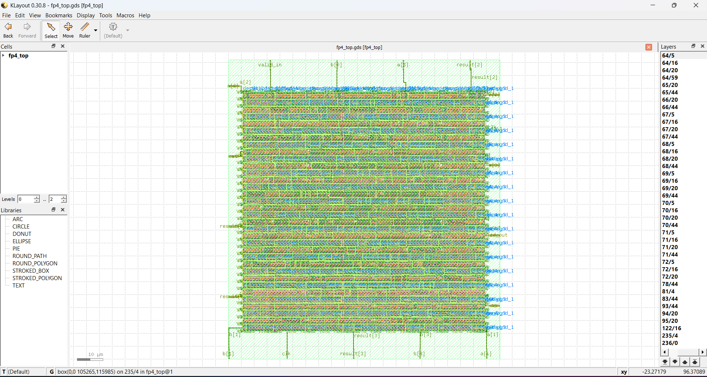

# FP4 Arithmetic Unit — RTL to GDSII



> Custom 4-bit Floating Point (FP4 E2M1) Arithmetic Unit designed 
> for AI inference acceleration — achieving **200 MHz timing closure** 
> with full **RTL-to-GDSII** physical design sign-off on 
> **SKY130A PDK** using OpenLane.

---

## Achievement Summary

| Metric | Result |
|--------|--------|
| Clock Frequency | **200 MHz** |
| WNS (Worst Negative Slack) | **Positive** ✅ |
| Die Area | **180 × 180 µm** |
| Process Node | **SKY130A (130nm)** |
| DRC Violations | **0** ✅ |
| LVS Result | **Clean** ✅ |
| Throughput | **1 result / cycle** |
| Latency | **2 clock cycles** |

---

## What is FP4 E2M1?

FP4 is a 4-bit floating point format used in modern AI inference engines:

```
Bit 3   Bits 2:1    Bit 0
Sign    Exponent    Mantissa
 1 bit   2 bits      1 bit
         bias = 1
```

| Bits | Value |
|------|-------|
| 0000 | 0.0 |
| 0001 | 0.25 |
| 0010 | 1.0 |
| 0011 | 1.5 |
| 0100 | 2.0 |
| 0101 | 3.0 |
| 0110 | 4.0 |
| 0111 | 6.0 (max) |
| 1xxx | Negative mirror |

---

## Design Architecture

```
         clk
          │
  a[3:0] ─┤    ┌─────────────┐    ┌──────────────┐    ┌────────────┐
  b[3:0] ─┤───►│  Stage 1    │───►│   Stage 2    │───►│  Stage 3  │───► result[3:0]
valid_in ─┤    │  Input FF   │    │  256-entry   │    │ Output FF  │───► valid_out
           │    │  addr_s1<=  │    │  comb. ROM   │    │           │
           │    │  {a,b}      │    │  (case stmt) │    │           │
           │    └─────────────┘    └──────────────┘    └────────────┘
           │
           └── 200 MHz, 5 ns period
```

**Key design decision:** All 16×16 = 256 FP4 arithmetic results are 
precomputed and stored in a combinational ROM (case statement). 
This eliminates all runtime arithmetic from the critical path — 
only one memory read delay separates input from output.

---

## Full RTL-to-GDSII Flow

```
FP4 Verilog RTL
      │
      ▼
 [Yosys Synthesis]
 Maps to SKY130 standard cells
 (NAND, NOR, DFF, MUX gates)
      │
      ▼
 [OpenROAD Floorplan]
 Die: 200×200 µm
 Core: 180×180 µm
      │
      ▼
 [Global + Detailed Placement]
 PL_TARGET_DENSITY = 0.25
      │
      ▼
 [Clock Tree Synthesis — CTS]
 Balanced clock distribution
      │
      ▼
 [TritonRoute — Global + Detail]
 Metal routing Met1–Met5
      │
      ▼
 [SPEF Extraction + OpenSTA]
 Sign-off STA — 200 MHz ✅
      │
      ▼
 [Magic DRC + Netgen LVS]
 0 violations ✅
      │
      ▼
 GDSII — fp4_top.gds ✅
```

---

## GDSII Layout


*Fabrication-ready GDSII layout viewed in KLayout 0.30.8.  
Dense standard-cell rows with full metal stack routing visible.*

---

## Tools Used

| Tool | Purpose |
|------|---------|
| OpenLane | RTL-to-GDSII automated flow |
| Yosys | Logic synthesis |
| OpenROAD | Floorplan, placement, CTS |
| TritonRoute | Detailed routing |
| OpenSTA | Static timing analysis |
| Magic VLSI | DRC physical verification |
| Netgen | LVS netlist comparison |
| KLayout | GDSII layout viewer |
| SKY130A PDK | 130nm open-source process |
| Python 3 | LUT table generator |

---

## FPGA Prototype (Earlier Phase)

The design was first prototyped on **Xilinx Artix-7 FPGA**:

| Metric | Result |
|--------|--------|
| Tool | Xilinx Vivado 2019.1 |
| Device | xc7a35tcpg236-1 |
| Frequency | 200 MHz |
| WNS | 1.898 ns |
| Strategy | LUTRAM + 3-stage pipeline |

See `vivado/` folder for the FPGA implementation files.

---

## How to Run OpenLane Flow

### Prerequisites
```bash
# Docker must be installed
docker --version

# Clone OpenLane
git clone https://github.com/The-OpenROAD-Project/OpenLane.git
cd OpenLane
make           # downloads PDK and tools (~15 GB)
make test      # verify installation
```

### Setup
```bash
# Copy design into OpenLane
cp -r openlane/ ~/OpenLane/designs/fp4_arithmetic/

# Generate Verilog files from LUT generator
cd ~/OpenLane/designs/fp4_arithmetic
python3 generate_lut.py
```

### Run
```bash
cd ~/OpenLane
sudo make mount
```

Inside Docker:
```bash
./flow.tcl -design fp4_arithmetic
```

### Check Results
```bash
# Timing — WNS must be positive
grep "WNS" designs/fp4_arithmetic/runs/RUN_*/reports/signoff/*sta*.rpt

# DRC — must be 0 violations
cat designs/fp4_arithmetic/runs/RUN_*/reports/magic/*drc*.rpt

# View GDSII
klayout designs/fp4_arithmetic/runs/RUN_*/results/final/gds/fp4_top.gds
```

---

## File Structure

```
FP4-Arithmetic-Unit/
├── rtl/                 Verilog RTL source
│   ├── fp4_mul.v        FP4 multiplier (256-entry ROM)
│   ├── fp4_add.v        FP4 adder (256-entry ROM)
│   └── fp4_top.v        Top-level wrapper
├── openlane/            OpenLane ASIC flow
│   ├── config.json      OpenLane configuration
│   ├── constraints.sdc  Timing constraints (200 MHz)
│   └── generate_lut.py  Auto-generates all Verilog + config
├── vivado/              FPGA prototype files
│   └── fp4_unit_flex.v  Original Vivado implementation
├── testbench/
│   └── fp4_tb.v         Exhaustive 16×16 testbench
└── results/
    ├── screenshots/     KLayout and Vivado screenshots
    └── reports/         Timing and DRC reports
```

---

## Performance vs FP16 / FP32

| Format | Bits | Bandwidth | vs FP4 |
|--------|------|-----------|--------|
| FP4 (this work) | 4 | 1× | baseline |
| FP8 | 8 | 2× more | 2× slower |
| FP16 | 16 | 4× more | 4× slower |
| FP32 | 32 | 8× more | 8× slower |

FP4 reduces memory bandwidth requirements by **4× vs FP16** 
and **8× vs FP32** — critical for edge AI inference where 
memory bandwidth is the bottleneck.

---

## About

**Asad Ali** — Final-year Electronic Engineering student  
Quaid-e-Awam University of Engineering Sciences and Technology  
Nawabshah, Sindh, Pakistan

- LinkedIn: [linkedin.com/in/asad-ali-4932a028b](https://linkedin.com/in/asad-ali-4932a028b)
- GitHub: [github.com/Asadkhan282](https://github.com/Asadkhan282)
- Email: asadshar0123@gmail.com

---

## License

MIT License — see [LICENSE](LICENSE) for details.
